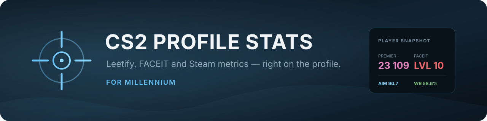
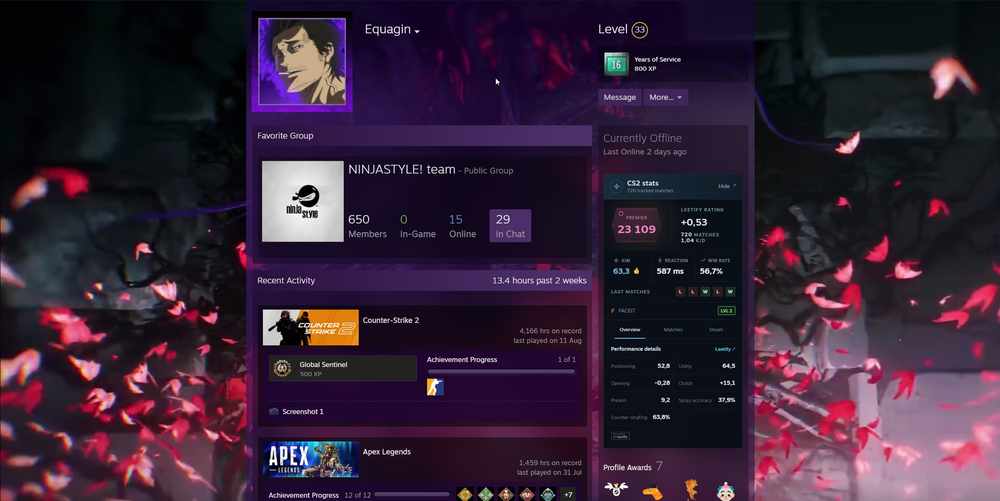
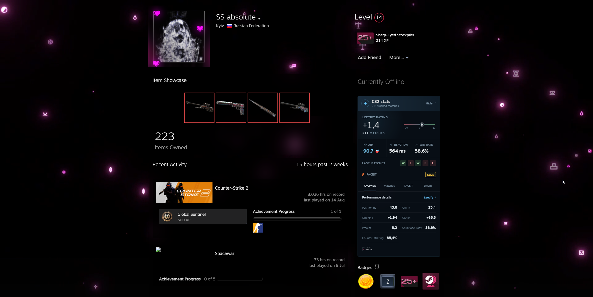

<div align="center">
  
</div>

<div align="center">

[](https://github.com/Shightrox/millennium-cs2-profile-stats/actions/workflows/ci.yml)
[](https://github.com/Shightrox/millennium-cs2-profile-stats/releases)
[](https://steambrew.app/)
[](LICENSE)

Useful CS2 statistics, embedded directly into Steam Community profiles.

</div>

## Preview

### Premier + FACEIT



### No Premier rating



The card sits below the profile's online status and adapts to the data available for that player. Open **Details** for recent matches, extended Leetify and FACEIT metrics, Steam activity, and an optional inventory estimate.

## Features

- Premier rating with native CS2 rank colors
- FACEIT level, ELO, lifetime stats, and level colors
- Leetify rating, recent K/D, Aim, Positioning, Utility, and Opening
- Reaction time or SCOPE.GG AWP time-to-damage when available
- Win rate, tracked match count, and recent match results
- Recent match history with map, date, source, and score
- Steam CS2 hours, recent playtime, and account creation date
- On-demand estimate for public CS2 inventories using Steam Market prices
- Compact summary plus Overview, Matches, FACEIT, and Steam detail tabs
- Independent provider loading, so one unavailable source does not hide the rest
- No mandatory API keys, telemetry, or persistent player-stat storage

## Installation

### Release archive

1. Download the latest `cs2-profile-stats-v*.zip` from [Releases](https://github.com/Shightrox/millennium-cs2-profile-stats/releases).
2. Extract the `cs2-profile-stats` folder into `<Steam>/millennium/plugins/`.
3. Restart Steam.
4. Open **Steam → Millennium → Plugins**, enable **CS2 Profile Stats**, and save the changes.

An installation through the SteamBrew plugin directory is planned after review.

### Development checkout

Clone the repository and create a directory junction or symbolic link from Millennium's plugin folder to the checkout:

```powershell
New-Item -ItemType Junction `
  -Path '<Steam>\millennium\plugins\cs2-profile-stats' `
  -Target '<repository path>'
```

Then install dependencies, build, and restart Steam:

```powershell
pnpm install
pnpm typecheck
pnpm build
```

Backend changes require a full Steam restart.

## Data sources

- [Leetify Public CS API](https://api-public-docs.cs-prod.leetify.com/) for Leetify and Premier metrics. A developer key is optional and only improves rate limits. The plugin can fall back to the keyless profile endpoint used by Leetify's web client for public legacy profiles.
- [SCOPE.GG](https://scope.gg/) public player pages for an AWP time-to-damage range when that metric is available.
- [Faceit Finder](https://faceit-finder.com/) for zero-configuration Steam-to-FACEIT lookup and public FACEIT statistics.
- Steam Community public profile, inventory, and Market endpoints for Steam activity and the optional inventory estimate.

Third-party services may return incomplete data or change without notice. Private Steam game details hide playtime; private inventories cannot be valued. Inventory values are approximate and do not include sticker, float, pattern, or other item-specific premiums.

FACEIT lookup is isolated behind its own provider because the zero-configuration source is not an official versioned FACEIT API. If it changes, Leetify and Steam data continue to work.

Leetify data is displayed according to the [Leetify API Developer Guidelines](https://leetify.com/blog/leetify-api-developer-guidelines/).

## Settings

- Optional Leetify API key for higher rate limits
- Show or hide the Steam activity tab
- Expand details by default

## Development

```powershell
pnpm install --frozen-lockfile
pnpm typecheck
pnpm build
pnpm dlx luaparse backend/main.lua
```

Build artifacts are generated in `.millennium/Dist`. To create an installable archive:

```powershell
./scripts/package.ps1
```

Project structure:

- `backend/main.lua` — HTTP providers, normalization, configuration, and IPC responses
- `webkit/index.tsx` — Steam profile detection and card rendering
- `frontend/index.tsx` — Millennium plugin settings
- `static/` — scoped styles and attribution assets

See [CONTRIBUTING.md](CONTRIBUTING.md) before submitting a change and [CHANGELOG.md](CHANGELOG.md) for release history.

## Privacy

The plugin reads the public SteamID64 of the profile being viewed and requests public gameplay statistics from the services listed above. It does not collect telemetry, use analytics, or permanently store player statistics.

## License

Released under the [MIT License](LICENSE).

This project is not affiliated with Valve, Steam, Counter-Strike, Leetify, FACEIT, SCOPE.GG, or Faceit Finder. All product names and trademarks belong to their respective owners.
